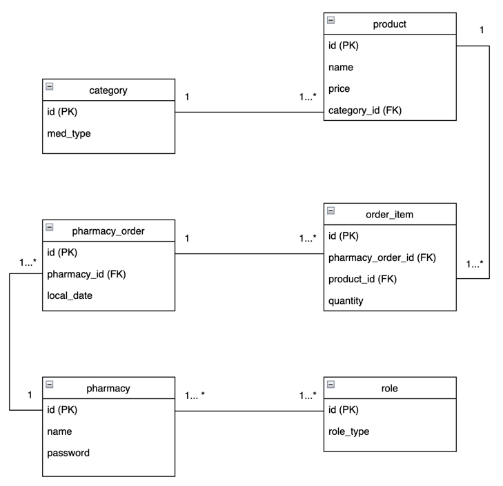

# PharmaDepot

PharmaDepot is a Spring Boot application designed to manage a pharmaceutical warehouse, handling orders from pharmacies for various medications. The application includes authentication and authorization using JWT tokens, and provides both pharmacy-specific and admin-specific functionalities.
Features
* Pharmacy Management: A registered Pharmacy can check the available products and can place an order
* Order Management: Allow pharmacies to place orders for medications, which include multiple products with specific quantities
* Product Management: Manage product details including name, price, and category (e.g., Analgesic, Antibiotic, Vitamin).
* JWT Authentication: Secure login for pharmacies to place orders.
* Admin Dashboard: Admin endpoint to view all pharmacies and orders.

## ERD
The entity relationship diagram is presented below.

## Technologies Used
* Spring Boot: For building the application and exposing REST endpoints.
* Spring Data JPA: For database interactions.
* Spring Security: For securing the application using JWT.
* JWT (JSON Web Tokens): For authenticating and authorizing users.
* PostgreSQL: For the relational database (can be switched to MySQL if preferred).
* Docker: To run the PostgreSQL database in a container.
* Lombok: To reduce boilerplate code.

# Getting Started
## Prerequisites
* JDK 11 or later
* Maven
* Docker

## Usage

### Import to Postman pharma-depot.postman_collection.json for easier set up of the endpoints. 
  
### Make sure to set up `baseURL` variable appropriately in the collection folder

* Login Endpoint: 
     `/api/v1/login` to authenticate and receive a JWT token.
* Logout Endpoint: `/api/v1/logout` to logout and delete all tokens.
* Register Endpoint: `/api/v1/register` to register new pharmacies.
* Refresh token Endpoint: `/api/v1/authentication/refresh-token`  by default JWT will expire after 10 minutes
* Products Endpoint: `/api/products` for pharmacies and admin to see all available products
* Order Endpoint:  
### ROLE_USER can access this endpoint
`/api/v1/orders` for pharmacies to place orders.  

### ROLE_ADMIN can access these points
`/api/v1/orders/monthly-orders/pharmacyName/year/month`  receive the number of orders per pharmacy per given month  
`/api/v1/orders/category-orders/pharmacyName/year/category`  receive the number of orders per category per year  
`/api/v1/orders/top-pharmacy/year`  receive the top pharmacy based on the yearly orders
 
